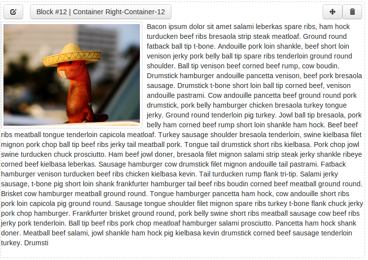

===============
Getting Started
===============

The core principle of *fancypages* (FP) is to provide the user with a way to
edit and enhance content without giving them too much control over style and
layout. The objective is to maintain the overall design of the website.

The project was born out of the need to add content editing capabilities to an
e-commerce project based on `django-oscar`_.

.. _`django-oscar`: https://github.com/tangentlabs/django-oscar

Basic Concepts
--------------

Before we get started with the installation and setup of *fancypages* (FP),
let's take a look a the underlying concepts to understand the components it's
assembled of. There are three major components in FP that you should know
about are *containers*, *blocks* and *pages*.

Containers and blocks are strongly related and form the most important part of
fancypages. As the name suggests, a container is an object that holds an
arbitrary number of other objects, in our case the *blocks*. These, in turn,
are the basic building blocks of FP.

Blocks
~~~~~~

A content block in FP is a Django model that defines specific content that is
editable by the user. This can be a simple ``CharField``, an ``ImageField`` or
any model field really. These fields are then editable on the front-end through
the editor panel. 

In addition to the actual content, each block also defines a template that
provides that specific layout for this content block. This works similar to
views in Django itself where ``template_name`` on a ``TemplateView`` can be
used to specify the path to a template file relative to the template directory.

A simple content block providing editable rich text might look similar to
this::

    from fancypages.models.blocks import ContentBlock
    from fancypages.library import register_content_block

    @register_content_block
    class TextBlock(ContentBlock):
        name = _("Text")
        code = 'text'
        template_name = "fancypages/blocks/textblock.html"

        text = models.TextField(_("Text"), default="Your text goes here.")

Containers
~~~~~~~~~~

To be able to place content block on a page we need to be able to specify where
these blocks can be placed on any given page. That's where containers come in.
They are basically placeholders in a template file that define where blocks can
be added. They are agnostic of their surrounding and simply expand to the
maximum area they can occupy within their enclosing HTML element.

Adding a container to a template will make sure that all block added to this
container are rendered whenever the template is rendered. Additionally, they
are an indication for FP to display the editor panel to users with the right
permissions.

Let's look at how you can define containers in your own templates to get a
better idea of how they work. FP knows *two different types* of containers and
to illustrate the difference and how you can use them we'll look at the
following two examples:

1. The **named container** behaves similar to a variable. You specify a
   name for you container and wherever you use that name in a template the
   **same** container including all it's blocks is rendered. A simple example
   could look something like this::

    
    ...
    

        
    

    ...

   This defines a container named ``my-first-container``. When you now go to
   the page that uses this template, the FP editor panel will be displayed
   (assuming you are logged in as admin user) and you can add blocks to the
   container. 
   *Note:* You don't have to create the container yourself. The first time the
   template is rendered the container is created if it doesn't already exist.

2. The **model-related container** is similar in that it has to have a name.
   The difference is that we attach this container to a specific model instance
   by passing it into the template tag. Where does that make sense? Let's look
   at a simple blog app that contains a template for the detail page of each
   blog post. If you use a regular *named container* the exact same container
   with the exact same blocks will show up on **all** blog post pages.
   But that might not be what you want. If you want to be able to enhance the
   content of block posts individually you have to use a *model-related
   container* and attach it to the individual blog post.
   In a template it would look like this (assuming the blog post instance in
   the context is called ``post``)::

    
    ...
    <h1>{{ post.title }}</h1>

    

    
{{ post.content|safe }}

Installation
------------

You can use *django-fancypages* as standalone app in your Django project or you
can integrate it with your `django-oscar`_ shop using the included extension
module. Most of the installation steps are exactly the same for both so let's
go through these steps first. After you have completed them, follow the 

1. Install via pip into you virtualenv (for now you have to install from
   the github repo because we haven't released it to PyPI yet)::

    $ pip install git+https://github.com/tangentlabs/django-fancypages.git

2. Add the required apps to your ``INSTALLED_APPS`` by simply using the
   convenience function ``get_apps`` in the ``fancypages`` module::

    from fancypages import get_required_apps, get_fancypages_apps

    YOUR_OTHER_APPS = [
        ...
    ]
    INSTALLED_APPS = YOUR_OTHER_APPS + get_required_apps() + get_fancypages_apps()

3. Add the editor middleware that provides the editing panel to every
   fancypage or page that contains an FP container::

    MIDDLEWARE_CLASSES = (
        ...
        'fancypages.middleware.EditorMiddleware',
    )

4. Add the urls for ``django-fancypages`` to your project's main
   ``urls.py``. Make sure that it is at the end of you definitions
   otherwise the it will prevent your other URLs from working because it
   defines a rather generic URL pattern for its pages::

    urlpatterns = patterns('',
        ...
        url(r'^', include(fancypages.urls)),
    )

5. Fancypages requires several default settings to be added. To make sure
   that you have all the default settings in your settings, you can use
   the defaults provided by fancypages itself. Add the following in your
   settings file **before** you overwrite specific settings::

    ...

    from fancypages.defaults import *

    ...
